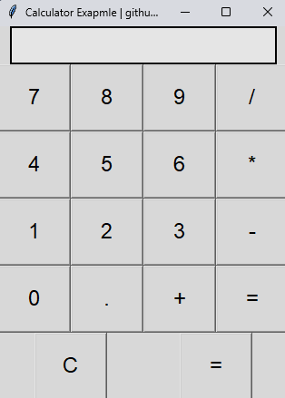

# 🧮 Calculator App with Python & Tkinter

Welcome to the **Calculator App** repository! 🎉 This is a simple yet powerful calculator with a graphical user interface (GUI) built using Python and Tkinter. Whether you're doing basic math operations or just want to see how a simple Python GUI app works, this project has got you covered! 😎

## ✨ Features
- 📱 **Simple GUI** – Easy-to-use interface with a clean layout
- ➕ **Basic Operations** – Supports addition, subtraction, multiplication, and division
- 🖱️ **Click or Type** – Use the buttons or type directly into the calculator
- ❌ **Clear Functionality** – Easily reset your calculations
- 🎯 **Responsive Design** – Adjusts to any screen size

## 🚀 How to Run
1. **Clone the repo**:
   ```bash
   git clone https://github.com/DanisHome/calculator-ui
   cd calculator-app
   ```
2. **Run the script**:
   ```bash
   python calculator.py
   ```

## 🛠 Requirements
- 🐍 **Python 3.x**
- 📦 **Tkinter** – Comes pre-installed with Python on most systems

## 📸 Screenshots


## 🤝 Contributing
- Fork it 🍴
- Create your feature branch 
- Commit your changes 
- Push to the branch 
- Open a pull request

## 🙌 Acknowledgments
Special thanks to the Python and Tkinter community for the awesome tools that made this project possible!